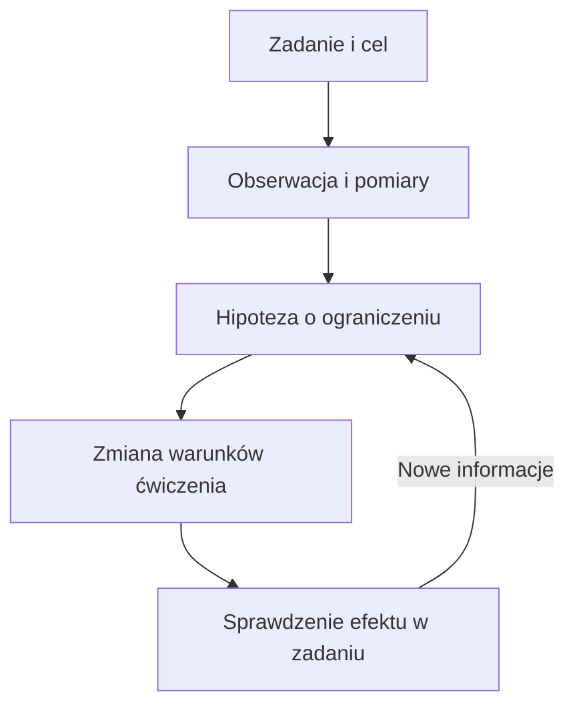

# Jak myśli Hartman — prosta rekonstrukcja

To opis jego rozumowania na podstawie wypowiedzi, a nie potwierdzenie skuteczności klinicznej całego modelu. Źródła, czasy i zakres sprawdzenia są w [przeglądzie korpusu](przeglad-korpusu.json). Szersze wyjaśnienie pojęć znajdziesz w [przewodniku](przewodnik.md).

Rozwinięcie z wybranych fragmentów 15 długich nagrań znajdziesz w [decyzjach wyjaśnionych na podstawie długich filmów](dlugie-filmy.md). Nowe ustalenia L01–L60 mają osobny [rejestr źródłowy](dlugie-filmy.json); zakres ich odczytu różni się od wcześniejszego przeglądu.

**Najpierw konkret:** w teście unoszenia nogi w staniu patrzy na boczną ucieczkę miednicy, unoszenie biodra, przechylenie tułowia i kierunek kolana. W pomiarze barku kontroluje obrót ramienia; po dobranym wariancie noszenia ciężaru ponawia test przy ścianie, szukając wyższego zakresu bez zmiany kierunku łokcia i kontaktu pleców. W osobnym przypadku proponuje wstawanie z siedziska, na którym biodra są powyżej kolan, lewa stopa przed prawą, z naciskiem prawej stopy. Szuka więcej lewej ER i prawej IR biodra oraz zmiany kontaktów stóp. Źródła: **K01–K04, K10–K14, K18–K20** w [instrukcjach konkretnych testów i ćwiczeń](konkretne-przypadki.md).

Tam znajdziesz kolejność wykonania, oczekiwania dla poszczególnych przypadków i filmy z czasami. Poniższe pojęcia pomagają zrozumieć, dlaczego autor dokonuje tych wyborów.

## 1. Najpierw zadanie i cel

„Chcę czuć się swobodniej w codziennym ruchu” i „chcę rzucać jak najszybciej” to różne cele. W pierwszym przypadku Hartman mówi o poszerzaniu dostępnych możliwości ruchu. W drugim o wybieraniu kompromisu, który pozwala osiągać wynik.

Zawodnik może potrzebować pewnej sztywności do mocnego wykonania zadania. Nie wynika z tego, że każdy powinien być sztywny ani że każdy powinien mieć maksymalny zakres ruchu. Autor chce śledzić tę samą osobę w czasie i zestawiać jej pomiary z wykonaniem zadania. Źródło: **C01–C04**.

## 2. Obecny ruch jest rozwiązaniem

Jeżeli ktoś stale wykonuje zadanie w określony sposób, Hartman pyta: „Dlaczego to rozwiązanie jest dla niego dostępne lub łatwe?”. Używa słowa „kompensacja”, ale nie utożsamia go automatycznie z uszkodzeniem.

To rozwiązanie może mieć koszt: osoba dobrze wykonuje jedną część zadania, a gorzej inną. Przykładowo, autor rozdziela możliwość pochłaniania energii od możliwości jej oddawania. Źródła: **C09, C13–C14**. To język wyjaśniający model; z takiego opisu nie wynika jeszcze rozpoznanie kliniczne.

## 3. Zobacz cały sposób wykonania

„Biodro obraca się o tyle stopni” jest obserwacją. Wyjaśnienie, skąd bierze się ten wynik, jest osobną hipotezą. Hartman rozdziela ruch części względem siebie od przestawienia większej części ciała jako całości.

W jego przykładzie praca nóg może być powiązana również z organizacją klatki piersiowej. Dlatego wynik jednego testu nie jest dla niego pełną mapą problemu. Źródła: **P1–P2, C05, C22**.

Autor ostrzega także przed śledzeniem tylko jednego zakresu: wzrost IR może współistnieć z utratą ER. Dlatego trzeba zapisać zarówno zysk, jak i koszt zmiany. Źródło: **C28**. Poprawa wyniku po ćwiczeniu także nie dowodzi sama w sobie konkretnego mechanizmu tkankowego.

Zmiana wyglądu ruchu nie musi oznaczać zmiany, której szukasz. W przykładzie przysiadu Hartman pyta, czy nowa pozycja tylko przeniosła dotychczasową strategię do innej części ciała. Jednocześnie dopuszcza, że taka strategia może służyć wynikowi w trójboju. **Najpierw ustal, co ma się poprawić; dopiero potem oceniaj wykonanie.** Źródło: **C25**.

## 4. Ćwiczenie to zestaw warunków

Pozycja ciała, kontakty z podłożem, kierunek oporu, rozmieszczenie ciężaru i oddychanie mają według autora wpływać na sposób wykonania ruchu. Sama nazwa ćwiczenia nie opisuje tych warunków.

Dlatego dwie osoby mogą robić „to samo ćwiczenie”, lecz rozwiązywać je inaczej. Pytanie brzmi: „Czy te warunki wywołały zmianę, której szukałem?”. Źródła: **C08, C20, C24**. Szczegóły demonstracji wymagają obejrzenia obrazu; tekst nie wystarcza do odtworzenia dokładnego ustawienia.

## 5. Kolejność ma znaczenie

W omawianym warsztacie Hartman wskazuje błąd: próba przejścia w nowym kierunku, zanim udało się opanować dotychczasowy ruch do przodu i w prawo. Jednocześnie zastrzega, że nie wystarczy wszystkim ustawić prawej nogi z przodu. Jeśli ciężar jest już nad nią, trzeba najpierw stworzyć możliwość jej odciążenia.

Uproszczenie brzmi: **zanim poprosisz o nowy ruch, sprawdź, czy osoba ma warunki, żeby go rozpocząć.** To nasza interpretacja dydaktyczna jego przykładu, nie reguła „prawo źle, lewo dobrze”. Źródła: **C06–C07**.

## 6. Sprawdź efekt i popraw hipotezę

Autor opisuje wielokrotne testowanie i ponowne testowanie. Mówi również o zmianach własnej interpretacji pomiarów i faz ruchu. Starsze i nowsze nagrania nie muszą więc przedstawiać identycznej wersji modelu. Źródła: **C11–C12, C35**. Udana kolejność pracy w jednym przypadku nie staje się automatycznie regułą dla kolejnej osoby.

W dłuższej rozmowie pyta konkretnie, czy poprawa uzyskana w odciążeniu pozostaje po wstaniu. W rozmowie o programowaniu pyta, czy dodatkową siłę można wykorzystać w czasie dostępnym w sporcie. Te przykłady pokazują dwa poziomy sprawdzenia: odpowiedź na ćwiczenie oraz efekt w zadaniu docelowym. Źródła: **L06, L27**.

Również po sukcesie wraca do alternatywnych wyjaśnień i skutków drugorzędnych. W praktyce jego rozumowanie pozostaje hipotezą aktualizowaną przez nowe informacje. Źródła: **L25–L26, L46–L47**.

Schemat jest uproszczoną rekonstrukcją analityka. Nie ustala, jakie ćwiczenie wybrać dla konkretnego pacjenta.

## Gdzie mieszczą się ISA, oddech i „szachownica”?

| Element        | Prostsze znaczenie w rozumowaniu                                                                                          |
| -------------- | ------------------------------------------------------------------------------------------------------------------------- |
| ISA i archetyp | Punkt wyjścia do hipotezy o tendencjach budowy; obecny pomiar może być zmieniony przez kolejne adaptacje.                 |
| Ruch względny  | Części mogą zmieniać położenie względem siebie.                                                                           |
| Orientacja     | Większa część ciała zmienia położenie jako całość.                                                                        |
| Oddech         | Jedna z możliwości zmiany warunków ruchu; nazwa strategii nie zawsze oznacza dosłownie fazę oddychania podczas chodzenia. |
| Szachownica    | Zestaw pomiarów, który autor interpretuje razem, aby postawić hipotezę.                                                   |
| Test–retest    | Sprawdzenie reakcji; nie jest samodzielnym dowodem całej teorii.                                                          |

Źródła: **P1–P3, G1–G3, C09–C12**. Liczba powtórzeń danej idei w filmach mówi o znaczeniu tej idei dla autora, nie o liczbie niezależnych potwierdzeń naukowych.

## Pytania, z którymi oglądać kolejne filmy

1. Jakie zadanie i jaki cel omawia?
2. Co faktycznie obserwuje lub mierzy?
3. Jak wyjaśnia tę obserwację? Jakie inne wyjaśnienia pozostają możliwe?
4. Jakie warunki zmienia ćwiczeniem?
5. Co sprawdza po zmianie i czy wraca do pierwotnego zadania?

Jeśli w napisie pojawia się niejasna nazwa, nie dopisujemy jej znaczenia z pamięci. Wracamy do nagrania i zachowujemy niepewność, dopóki nie da się jej wyjaśnić.
